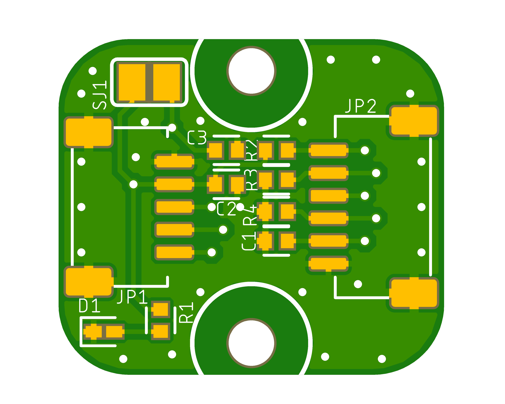
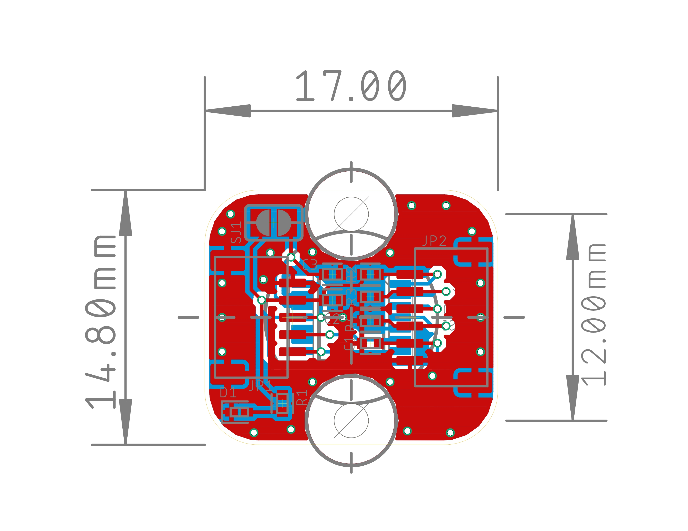

# Mini PCB para Encoder Magnético AS5047P

Diseño de una mini PCB para el encoder magnético de 14 bits **AS5047P**. Esta placa está diseñada para facilitar la integración del sensor en proyectos donde el espacio es limitado, proporcionando un acceso sencillo a sus interfaces SPI y ABI a través de conectores JST-SH.

| Vista Superior de la PCB | Dimensiones |
| :---: | :---: |
|  |  |

## Características Técnicas

- **Encoder Magnético:** AMS AS5047P
- **Tamaño de la PCB:** 17 x 14.8 mm
- **Agujeros de Montaje:** 2x agujeros de Ø2mm, separados por 12mm.
- **Esquinas:** Redondeadas con un radio de ~3.1mm.
- **Conectores:** JST-SH de 1mm pitch SMD (Horizontale/Side).
  - **Puerto SPI:** Conector de 6 pines.
  - **Puerto ABI:** Conector de 5 pines.
- **Selección de Voltaje:** Jumper soldable (SJ1) para elegir entre **3.3V** (puente cerrado) o **5V** (puente abierto).
- **Indicador:** LED de alimentación (D1).

## Lista de Componentes (BOM)

| Referencia | Valor/Componente | Encapsulado |
| :--- | :--- | :--- |
| IC1  | AS5047P       | TSSOP-14     |
| C1, C2 | 0.1uF              | 0402        |
| C3   | 4.7uF              | 0402        |
| D1   | LED Verde/Rojo     | 0402        |
| R1   | 120Ω              | 0402        |
| R2, R3, R4 | 10kΩ               | 0402        |
| JP1  | Conector JST-SH 5P | SM05B-SRSS-TB |
| JP2  | Conector JST-SH 6P | SM06B-SRSS-TB |

## Archivos del Repositorio

- **Archivos de Diseño (Eagle):**
  - `[AS5047P.sch](AS5047P.sch)`: Archivo del esquemático.
  - `[AS5047P.brd](AS5047P.brd)`: Archivo de la placa (board).
- **Archivo de Fabricación:**
  - `[AS5047P_2024-10-15.zip](AS5047P_2024-10-15.zip)`: Paquete con archivos Gerber para fabricación.
- **Documentación y Vistas Previas:**
  - `[AS5047P_esquematico.pdf](AS5047P_esquematico.pdf)`: Esquemático en formato PDF.
  - `[AS5047P_SIZE.pdf](AS5047P_SIZE.pdf)`: Documento PDF con las dimensiones de la PCB.
  - `[CAD.png](CAD.png)`: Imagen del archivo CAD con las geometrías de la PCB.
  - `[AS5047P_TOP.png](AS5047P_TOP.png)`: Imagen de la vista superior de la PCB.
  - `[AS5047P_BUTTON.png](AS5047P_BUTTON.png)`: Imagen de la vista inferior de la PCB.
  